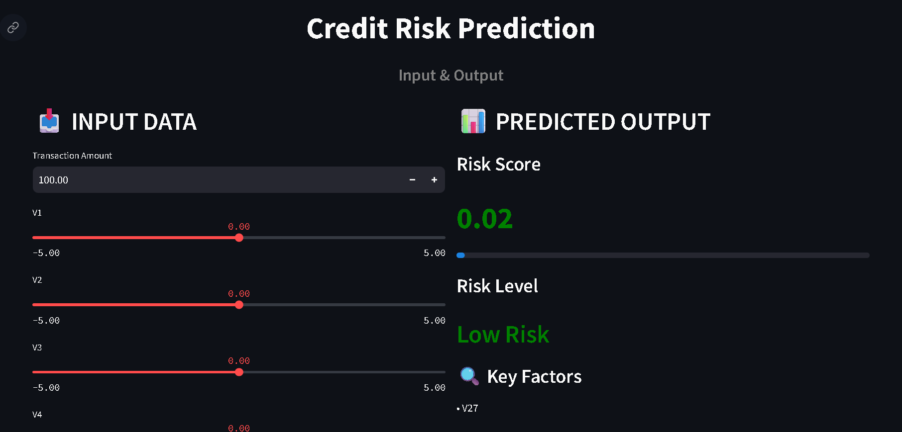

# 💳 Credit Risk Prediction System


---

## 📌 Overview

The **Credit Risk Prediction System** is an end-to-end Machine Learning application designed to identify high-risk financial transactions. It predicts the probability of fraud/default and helps organizations make data-driven decisions to reduce financial losses.

This project integrates **Machine Learning, Explainable AI (SHAP), and Streamlit UI** into a complete pipeline.

---

## 🎯 Business Objective

* Assess creditworthiness of transactions
* Detect fraudulent activities
* Reduce financial losses
* Enable data-driven decision making
* Automate risk evaluation process

---

## 🧩 Problem Statement

Traditional fraud detection systems rely on:

* Manual verification
* Rule-based systems

These approaches:

* Lack scalability
* Are prone to bias
* Fail to capture complex patterns

👉 This project solves the problem using a **Machine Learning classification model**.

---

## 📊 Dataset Information

* **Dataset:** Credit Card Fraud Detection
* **Total Records:** 284,807
* **Features:** 30
* **Target Variable:** `Class`

| Value | Meaning            |
| ----- | ------------------ |
| 0     | Normal Transaction |
| 1     | Fraud / Risk       |

---

## 🧠 Feature Explanation

* `V1–V28`: PCA-transformed anonymized features
* `Amount`: Transaction amount
* `Time`: Dropped during preprocessing

---

## 🔄 Machine Learning Pipeline

### 🔹 Data Preprocessing

* Removed unnecessary columns
* Scaled `Amount` using StandardScaler
* Handled imbalance using SMOTE

### 🔹 Model Building

* Algorithm: **Random Forest Classifier**
* Optimized parameters for performance

### 🔹 Model Validation

* Stratified Train-Test Split
* Cross Validation (K-Fold)
* Evaluation using ROC-AUC

---

## 📈 Model Performance

* **ROC-AUC Score:** 0.97+
* High Recall for fraud detection
* Balanced Precision and Recall

---

## ⚖️ Handling Class Imbalance

Fraud cases are rare:

* Applied **SMOTE (Synthetic Oversampling)**
* Ensured balanced learning

---

## 🤖 Explainable AI (SHAP)

* Used SHAP for model interpretability
* Identifies key features impacting predictions
* Improves transparency

---

## 💻 Web Application (Streamlit)

### 🚀 Features

* Interactive UI
* Real-time prediction
* Risk Score (0–1)
* Risk Level:

  * 🟢 Low Risk
  * 🟡 Medium Risk
  * 🔴 High Risk
* Key contributing factors

---

## 📸 Application Preview


This is the user interface of the Credit Risk Prediction system built using Streamlit.



---

## 🛠️ Tech Stack

* Python
* Pandas, NumPy
* Scikit-learn
* Imbalanced-learn (SMOTE)
* SHAP
* Streamlit

---

## 📁 Project Structure

```
credit-risk-prediction-system/
│── data/
│── notebooks/
│── models/
│── app/
│    └── app.py
│── requirements.txt
│── README.md
```

---

## ⚙️ Installation & Setup

### 🔹 Clone Repository

```
git clone https://github.com/YOUR_USERNAME/credit-risk-prediction-system.git
cd credit-risk-prediction-system
```

### 🔹 Install Dependencies

```
pip install -r requirements.txt
```

### 🔹 Run Application

```
cd app
streamlit run app.py
```

---

## 🌐 Live Demo

👉 Add your deployed app link here

---

## 💼 Resume Highlight

Developed an end-to-end Credit Risk Prediction system using Random Forest with SHAP-based explainability and deployed using Streamlit for real-time predictions.

---

## 🚀 Future Improvements

* Use real-world financial dataset
* Add advanced dashboards
* Implement XGBoost / LightGBM
* Cloud deployment (AWS/GCP)

---

## 🙌 Acknowledgment

This project is built for learning and demonstration of Machine Learning and Data Science concepts.

---

## 📬 Contact

Feel free to connect for any queries or collaboration.
